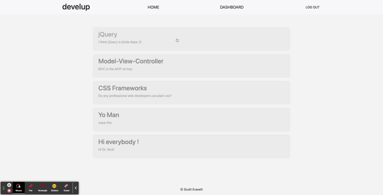

# Tech-Blog Full Stack Application

## Description 
A blog style full stack web application for web developers to have an organized space to engage in dialogue regarding programming

## Table of Contents

* [Installation](#installation)
* [Usage](#usage)
* [Contributing](#contributing)
* [Credits](#credits)
* [License](#license)

## Installation

This application is deployed live on heroku, therefore  all that is needed to interact wiht it is a browser and an internet connection

## Usage 

Upon visiting the home page, navigate throughout the site using the nave bar and other intuitive elements

 
 

## Contributing
To contribute to this application, you will require several dependencies, those being:
- bcrypt
- connect-session-sequelize
- dotenv
- express
- express-handlebars
- express-session
- mysql2
- sequelize

## License

This project is licensed under MIT.

## Questions

If you have any questions about this project, please contact me at burningcupidxxx@gmail.com. 
 

More projects can be viewed at https://github.com/scottybuoy